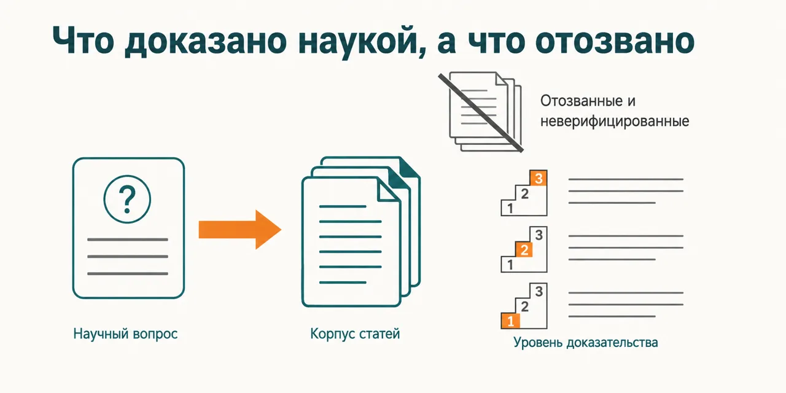
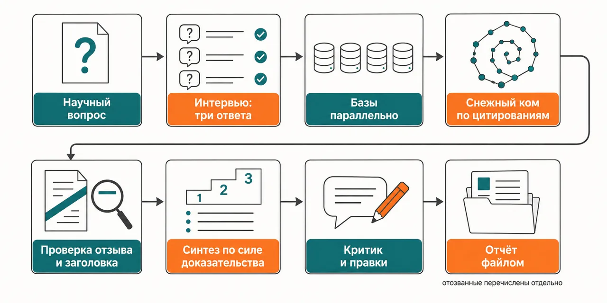

Русский · [English](README.en.md)

# «Наука доказала» — обычно пересказ пересказа, а статью могли отозвать ещё в прошлом году

Вопрос уходит сразу в научные базы, каждый найденный DOI проверяется в Crossref на отзыв и на
совпадение заголовка, а вывод собирается по GRADE — по силе доказательства, а не по громкости
заголовка.

```
claude plugin marketplace add https://github.com/beCyborg/jadlis-hub
claude plugin install jadlis-search@jadlis --config BRAVE_API_KEY=… --config FIRECRAWL_API_KEY=…
claude plugin install jadlis-science-research@jadlis
```

Порядок важен: `jadlis-science-research` тянет `jadlis-search` как зависимость, но при
авто-установке ключи не спрашиваются — поэтому `jadlis-search` ставится отдельно и сразу с ключами.



Текстом: слева научный вопрос, справа корпус статей, где отозванные и неверифицированные вынесены
в отдельную стопку, а у оставшихся выводов проставлен уровень доказательства.

Это моё рабочее место, выложенное как есть, а не продукт: чем перестал пользоваться — убрал.

## Было → стало

| Руками | Чатом с ИИ | Этим плагином |
|---|---|---|
| **Откуда взялось «доказано».** До самой работы никто не доходит: в ходу пересказ блога, который пересказал пресс-релиз. | Пересказывает те же вторичные тексты; до полного текста статьи не идёт, а источник называет не всегда. | Ходит за один прогон в PubMed, Europe PMC, Semantic Scholar, OpenAlex, ClinicalTrials.gov, Epistemonikos и по сайтам Cochrane, NICE и UpToDate, а потом добирает статьи по спискам цитирования — вперёд и назад. |
| **Отозванные статьи.** Отозванную работу цитируют годами после отзыва, и в пересказе этого не видно. | Отвечает по тому, что было в обучении: об отзыве, случившемся позже, не знает. | Каждый DOI проверяется в Crossref до синтеза — по трём сигналам отзыва; отозванные не попадают в выводы и перечисляются отдельной строкой. |
| **Правильная ли ссылка.** Проверить нечем, кроме как открыть каждую и сверить руками. | Ссылка выглядит настоящей и ведёт не туда: DOI и название расходятся. | Заголовок, который вернул Crossref, сверяется с заявленным; не совпал — статья помечена как неверифицированная и в доказательную таблицу не идёт. |
| **Сколько весит находка.** Один препринт и систематический обзор в пересказе весят одинаково. | Отдаёт самый уверенный ответ из доступных, а разброс качества работ не показывает. | Ставит GRADE по каждому исходу, а не по типу статьи: мета-анализ плохих испытаний не становится сильным доказательством, и «данных недостаточно» — тоже ответ. |
| **Кто спорит с выводом.** Спорить некому: черновик читает тот, кто его и составил. | Соглашается сам с собой и добавляет уверенности при уточняющем вопросе. | Отдельный критик ищет опровержения, перепроверяет отзыв по ключевым DOI и смотрит PubPeer. Ключевые утверждения проверяются перекрёстно, непроверенные помечены. |

## Как это работает



На входе — научный вопрос и три ответа: какое решение ты примешь по итогам, какая популяция в
фокусе, какой охват.
Внутри — базы опрашиваются параллельно, корпус добирается по цитированиям, каждый DOI проходит
Crossref на отзыв и на совпадение заголовка, затем GRADE-синтез и независимый критик с правками.
На выходе — отчёт файлом в твоих заметках: вердикт под твоё решение, чему верить, чего в данных
нет и что отсеяли.

Текстом: вопрос → интервью → базы параллельно → снежный ком по цитированиям → проверка отзыва и
заголовка → GRADE-синтез → критик и правки → отчёт файлом.

Числа в отчёт попадают только с дословной цитатой-локатором из статьи: нет цитаты — нет цифры,
эффект описывается словами.

## Установка и первый запуск

**а) Текст для вставки агенту.** Скопируй целиком в чат Claude Code:

```
Ты — установщик. Поставь на этот Mac плагин jadlis-science-research из маркетплейса jadlis.
Выполни ровно эти команды, дословно, ничего не сокращая:
1. claude plugin marketplace add https://github.com/beCyborg/jadlis-hub
2. claude plugin install jadlis-search@jadlis --config BRAVE_API_KEY=… --config FIRECRAWL_API_KEY=…
3. claude plugin install jadlis-science-research@jadlis
4. claude plugin list — покажи мне строки про jadlis-search и jadlis-science-research и их версии.
5. /jadlis-search:keys — заведи ключи научных источников: PubMed, Semantic Scholar, OpenAlex
   и почты для Crossref и Unpaywall.
Значения ключей Brave и Firecrawl вместо многоточий спроси у меня и подставь сам.
Порядок команд не меняй: jadlis-science-research тянет jadlis-search как зависимость, но при
авто-установке ключи не спрашиваются — поэтому jadlis-search ставится отдельно и сразу с ключами.
Перед каждой командой покажи её мне целиком и дождись «да». Сказал «нет» — не выполняй,
скажи, что именно пропустил, и иди дальше.
Команда вернула ошибку — остановись, покажи вывод, к следующей не переходи.
Значения ключей не печатай: проверяй только «есть» или «нет».
```

**б) Команды руками.**

```
claude plugin marketplace add https://github.com/beCyborg/jadlis-hub
claude plugin install jadlis-search@jadlis --config BRAVE_API_KEY=… --config FIRECRAWL_API_KEY=…
claude plugin install jadlis-science-research@jadlis
claude plugin list
```

Первая команда ничего не ставит — она добавляет маркетплейс. Ставит только вторая и третья, и
снимается это одной строкой: `claude plugin uninstall jadlis-science-research@jadlis --keep-data`.

**в) Короткая команда.** Открой Claude Code в папке, где работаешь, и набери:

```
/science-research <твой научный вопрос>
```

Плагин задаст три вопроса — какое решение ты примешь, какая популяция, какой охват; из ответов
строится сам запрос, поэтому пропустить их нельзя. Четвёртым спросит, читать ли твои заметки о
здоровье: скажешь «нет» — папка заметок не открывается вовсе.

Не находится — сверь имя строкой `claude plugin list`.

## Границы, стоимость, обновление

**Чего не делает.** Не заменяет врача и не ставит диагноз: отчёт — это разбор литературы, решение
о лечении принимается не здесь. Не читает полные тексты всех найденных статей — полный текст
тянется только у верхних открытых работ, остальное разбирается по абстрактам, и это записано в
самом отчёте. Не гарантирует полноту: корпус упирается в собственный потолок и в бюджет прогона,
и если часть найденного не вошла, отчёт говорит об этом строкой. Проверка отзыва идёт через
Crossref — отзыв, который туда не попал, плагин не увидит. И не решает за тебя: заметка выходит с
пометкой «не проверено человеком», ревью — твоё.

**Что нужно.** Плагин `jadlis-search` с ключами Brave и Firecrawl — ставится первым, ими работают
Cochrane, гайдлайны и Epistemonikos. Отдельно нужны ключи научных источников — PubMed, Semantic
Scholar, OpenAlex и контактные почты для Crossref и Unpaywall: они заводятся один раз командой
`/jadlis-search:keys`, значения уезжают в Связку ключей macOS. Без них часть баз уходит на анонимные
лимиты и отвечает через раз. Чужие тарифы не пересказываю: счета у поставщиков. Папка заметок
задаётся при установке (`VAULT_PATH`, по умолчанию `~/Jadlis`) — отчёт ложится в `Знания/Ресерчи`.
Obsidian закрыт — дедуп и простановка ссылок пропускаются, файл всё равно пишется.

Ключи хранятся в Связке ключей macOS; на Linux такого же помощника на базе `security` нет,
поэтому под Linux не проверялось.

**Порядок расхода токенов.** Тяжёлый прогон — десятки субагентов из твоей квоты: базы, добор по
цитированиям, проверка DOI батчами, синтез, критик и правки. Несколько прогонов подряд в одно окно
не помещаются — планируй научный разбор как отдельную задачу на сессию, а не как быстрый вопрос
между делом. Во что это обходится в деньгах — не мерил и цифру не назову.

**Проверено там, где я работаю:** мой Mac, моя подписка, мои ключи. Проверялось только на macOS.

**Условия использования.** Лицензии нет: все права сохранены за автором. Читать и
пользоваться лично можно. Коммерческое использование, переиздание и включение в свои
продукты — по договорённости со мной.

**Обновление.** У стороннего маркетплейса авто-обновление на твоей стороне выключено: пока не
запустишь первую команду, у тебя остаётся та версия, которую ты поставил.

```
claude plugin marketplace update jadlis
claude plugin update jadlis-science-research@jadlis
claude plugin list
```

Переустановка, если что-то встало криво:

```
claude plugin uninstall jadlis-science-research@jadlis --keep-data && claude plugin install jadlis-science-research@jadlis
```
